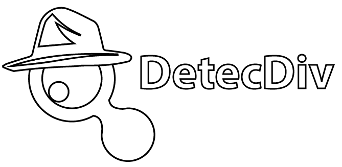

<!-- PROJECT SHIELDS -->
[![Contributors][contributors-shield]][contributors-url]
[![Forks][forks-shield]][forks-url]
[![Stargazers][stars-shield]][stars-url]
[![Issues][issues-shield]][issues-url]
[![MIT License][license-shield]][license-url]

<!-- PROJECT LOGO -->
 

  
  

    <i> Processing microscopy image sequences using Matlab, a graphical user-interface and deep learning classifiers </i>
     
     
  
 

<!-- ABOUT THE PROJECT -->

## About The Project ##

DetecDiv provides a comprehensive set of tools to analyze time microscopy images using deep learning methods. The software structure is such that data can be processed either at the command line or using a graphical user-interface. Detecdiv classification models include : image classification and regression, semantic segmentation, LSTM networks to analyze data and image timeseries. Please refer to our pre-print for further details about the software and its applications for yeast cell division counting and replicative lifespan analysis: 
    
<a href="https://www.biorxiv.org/content/10.1101/2021.10.05.463175v2">
   DetecDiv, a deep-learning platform for automated cell division tracking and replicative lifespan analysis
  </a>
    
   Théo Aspert, Didier Hentsch, Gilles Charvin
    
   <a href="https://www.biorxiv.org/content/10.1101/2021.10.05.463175v2"> https://doi.org/10.1101/2021.10.05.463175  </a>
  
  
 Please visit the <a href="https://charvin.igbmc.science"> Charvin lab website </a> for more information. 
  
    

(<a href="#top">back to top</a>)

## Table of contents

<!-- TABLE OF CONTENTS -->

 <!-- 
Table of Contents
 -->
  <ol>
    <li><a href="#about">About the project</a></li>
    <li><a href="#installation">Installation procedure</a></li>
    <li><a href="#gui">User guide</a></li>
    <li><a href="#demo">Demo project</a></li>
    <li><a href="#thanks">Acknowledgments</a></li>
  </ol>

## Installation procedure

We recommend using Matlab >= R2021a to ensure the compatibility of the software. DetecDiv requires the following toolboxes: 

-MATLAB                                                Version 9.10        (R2021a)

-Computer Vision Toolbox                               Version 10.0        (R2021a)

-Deep Learning Toolbox                                 Version 14.2        (R2021a)

-Image Processing Toolbox                              Version 11.3        (R2021a)

-Parallel Computing Toolbox                            Version 7.4         (R2021a)

-Statistics and Machine Learning Toolbox               Version 12.1        (R2021a)

Make sure to include all DetecDiv folders and subfolders in the Matlab path using the "Set Path" in the main Matlab workspace.

(<a href="#top">back to top</a>)

## User guide ##

A guide on how to use the graphical user-interface can be found here: 

 <a href="https://github.com/gcharvin/DetecDiv/blob/master/Tutorial/GUI_tutorial.md">GUI User guide</a>
 
A list of command-line instructions to use DetecDiv in scripts or in the Matlab workspace can be found here: 

 <a href="https://github.com/gcharvin/DetecDiv/blob/master/Tutorial/commandline_tutorial.md">Command-line instructions</a>
 
 
(<a href="#top">back to top</a>)

 
 

 
## DetecDiv demo project ##
 
A demo project that contains all the necessary files (i.e. raw image files, ROIs, groudtruth data, classifier models, trained classifiers) to learn how to use DetecDiv can be found here: 

(<a href="#top">back to top</a>)

<!-- ACKNOWLEDGMENTS -->
## Acknowledgments

Many thanks to those who provided the necessary resources to make this project possible, including the <a href="https://charvin.igbmc.science">Charvin lab</a> group members, the <a href="https://www.igbmc.fr">IGBMC staff and facilities</a>. 

(<a href="#top">back to top</a>)

 

<!-- MARKDOWN LINKS & IMAGES -->
<!-- https://www.markdownguide.org/basic-syntax/#reference-style-links -->
[contributors-shield]: https://img.shields.io/github/contributors/gcharvin/DetecDiv
[contributors-url]: https://github.com/gcharvin/DetecDiv/graphs/contributors
[forks-shield]: https://img.shields.io/github/forks/gcharvin/DetecDiv
[forks-url]: https://github.com/gcharvin/DetecDiv/network/members
[stars-shield]: https://img.shields.io/github/stars/gcharvin/DetecDiv
[stars-url]: https://github.com/gcharvin/DetecDiv/stargazers
[issues-shield]: https://img.shields.io/github/issues/gcharvin/DetecDiv
[issues-url]: https://github.com/gcharvin/DetecDiv/issues
[license-shield]: https://img.shields.io/github/license/gcharvin/DetecDiv
[license-url]: https://github.com/gcharvin/DetecDiv/blob/master/LICENSE.txt
[product-screenshot]: images/screenshot.png

